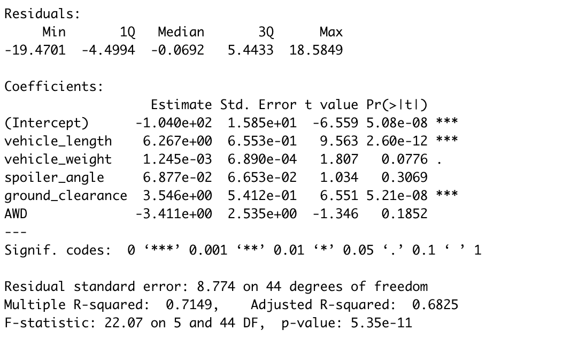
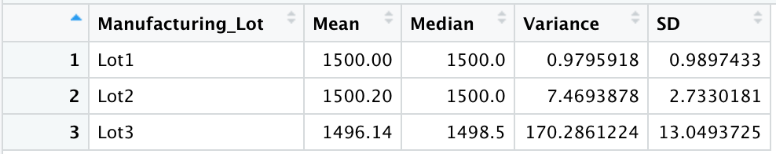
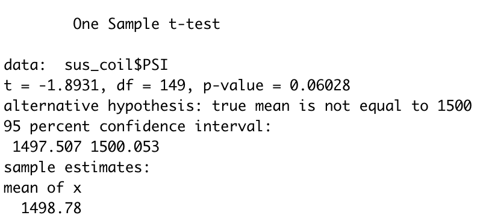
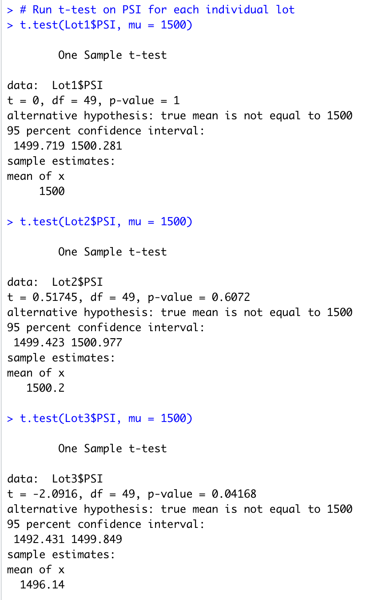

# MechaCar Statistical Analysis using R Studio

# Project Overview
The purpose of this analysis was to use production data on a new vehicle prototype, MechaCar, to determine vehicle performance across their different manufacturing lots. This analysis carried out the following:

1. Perform multiple linear regression analysis to identify which variables in the dataset predict the mpg of MechaCar prototypes.
2. Collect summary statistics on the pounds per square inch (PSI) of the suspension coils from the manufacturing lots.
3. Run t-tests to determine if the manufacturing lots are statistically different from the mean population.
4. Design a statistical study to compare vehicle performance of the MechaCar vehicles against vehicles from other manufacturers. 

## Linear Regression to Predict MPG

A non-random variable usually contains a variance of 0, which means the intercept, vehicle length and ground clerance coefficients provide a non-random amount of variance to the MPG. 
Due to a small p-value, we are able to reject the null hypothesis of slope = 0, meaning this linear model does not have a slope = 0. 
With an adjusted R-squared of 0.6825 this linear model does a good job of predicting the MPG of this prototype. 

## Summary Statistics on Suspension Coils

The design specifications for the suspension coils dictate that a variance of suspension must not exceed 100 pounds per square inch. When looking at the total summary, the overall variance shows that this manufacturing model meets these expectations. However, when looking at the lot summary, we can see the third lot has a significantly higher variance (170), which means a vehicle manufactured from this lot may not meet suspecion expectations by being over the 100 pounds per square inch variance. This means the third lot's manufacturing processes and quality are not up to overall expecations and needs to be addressed. 

## T-Test on Suspension Coils

### Across All Lots

For the summary data of coil suspension across all lots, the t-test shows that there is no statistical difference against the population mean. With a p-value greater than 0.05, we fail to reject the null hypothesis that the sample mean may be equal to the true population mean.

### Across Each Lot

### Lot 1 
Looking at the summary data for coil suspensions across Lot 1, we see there is no statistical difference from the population mean. The p-value is not below 0.05, therefore, we fail to reject the null hypothesis that the sample mean may be equal to the true population mean.

### Lot 2
Looking at the summary data for coil suspensions across Lot 2, we see there is no statistical difference from the population mean. The p-value is not below 0.05, therefore, we fail to reject the null hypothesis that the sample mean may be equal to the true population mean. 

### Lot 3
Loooking at the summary data for coil suspensions across Lot 3, we see there is a slight statistical difference from the population mean. The p-value is below 0.05, therefore, we reject the null hypothesis that the sample mean may be equal to the true population mean. Meaning, this lot may have quality issues and needs to be observed closer. This was also upheld in the variance in the suspension. 

## Study Design: MechaCar versus Competition
When looking at designing a study that can compare MechaCar agains the competition, we already have data that accurately predicts MPG, but it doesn't break it down by city or highway driving. All cars have a differences in the MPG efficiency when it comes to driving in the city, versus long-distance uninteruppted driving such as highway driving. Many times this is a selling point for people, especially when they are wanting more MPG across the board. 

The metrics that can be included in this analysis are:

1. Type of driving: city vs highway
2. MPG
3. Different variables that could effect MPG in city vs highway, such as weight, AWD, spoiler angle, and clearance.

Hypotheses to test:

1. Null hypothesis for city: MechaCar's average MPG in city driving is similar to competitor's same vehicles in city driving
2. Null hypothesis for highway: MechaCar's average MPG in highway driving is similar to competitor's same vehicles in highway driving
3. Alternative hypothesis for city: MechaCar's average MPG in city driving is significantly more efficient as compared to competitor's same vehicles in city driving
4. Alternative hypothesis for city: MechaCar's average MPG in highway driving is significantly more efficient as compared to competitor's same vehicles in highway driving
